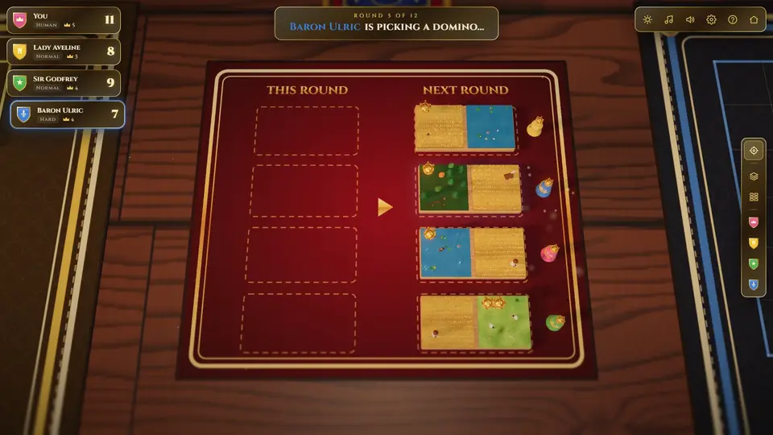
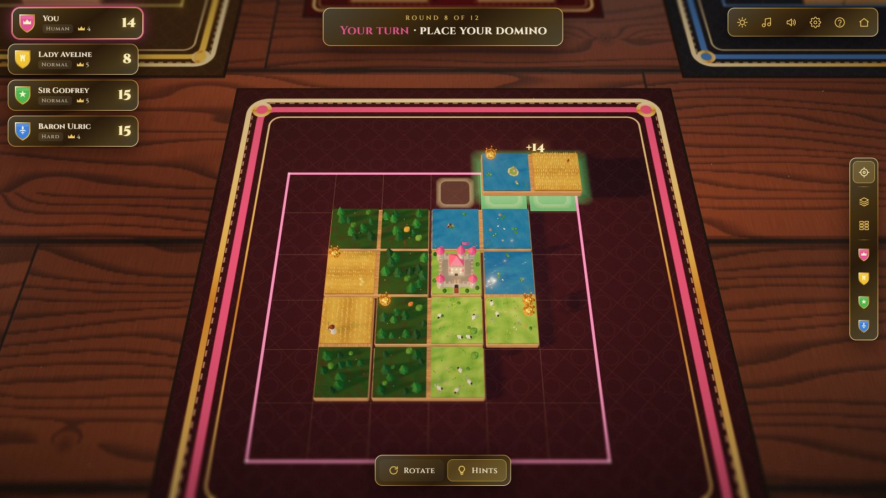
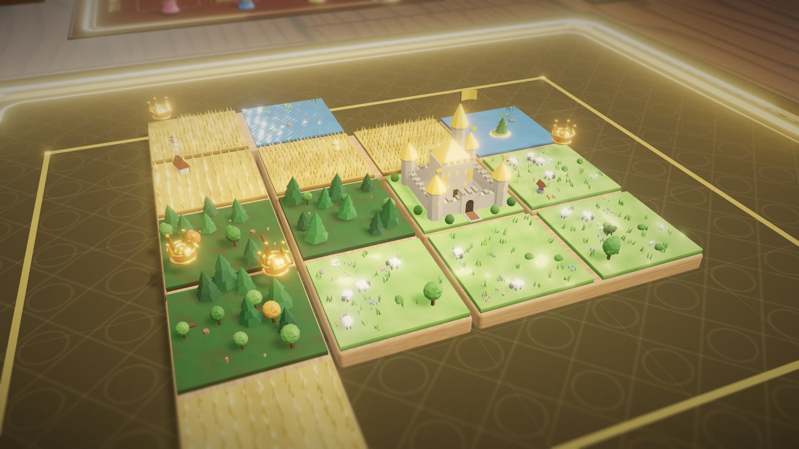
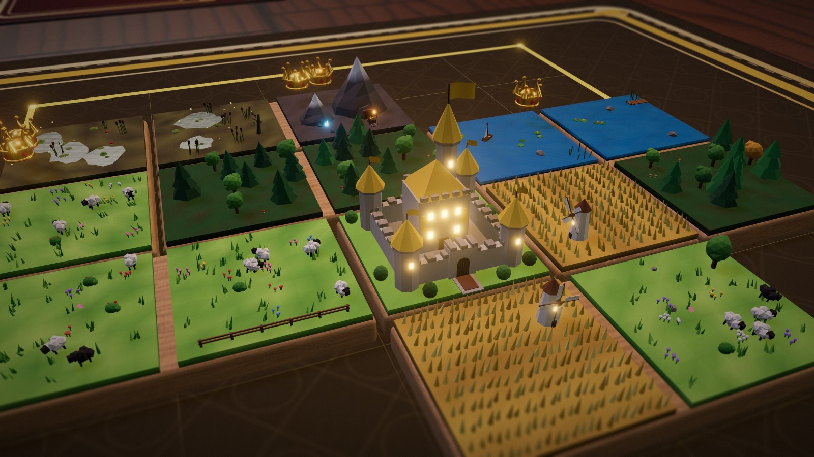
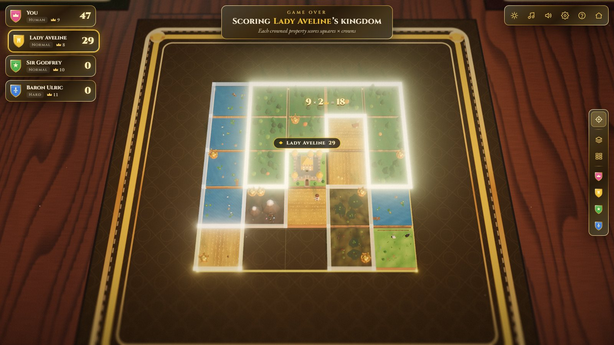
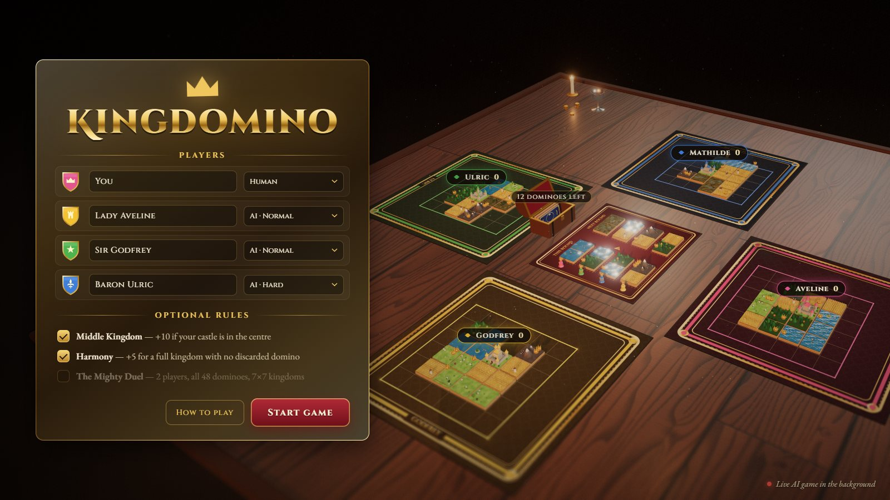
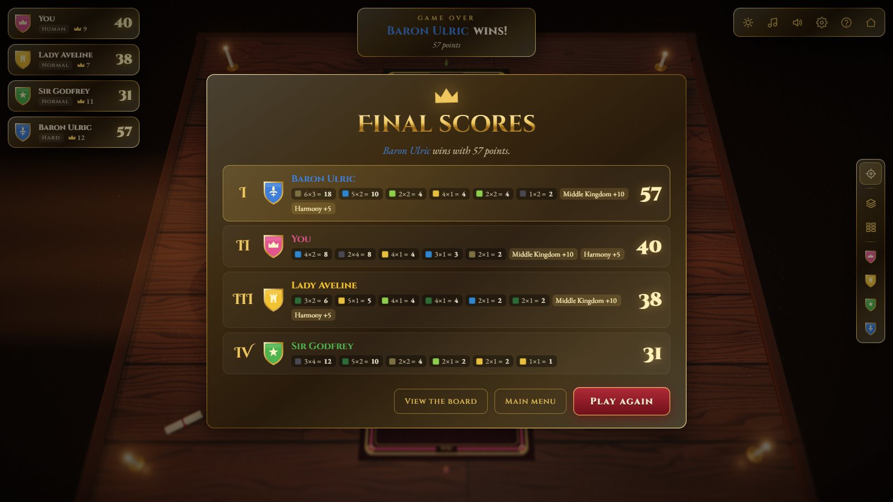
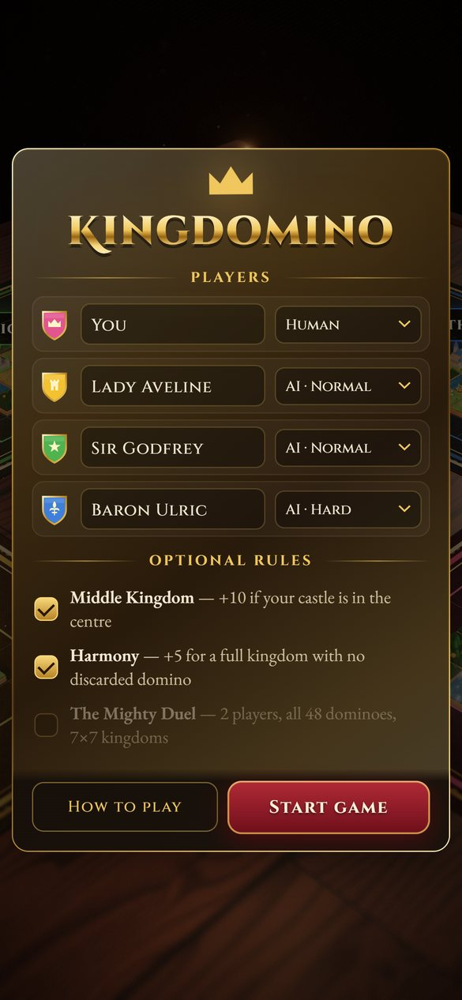
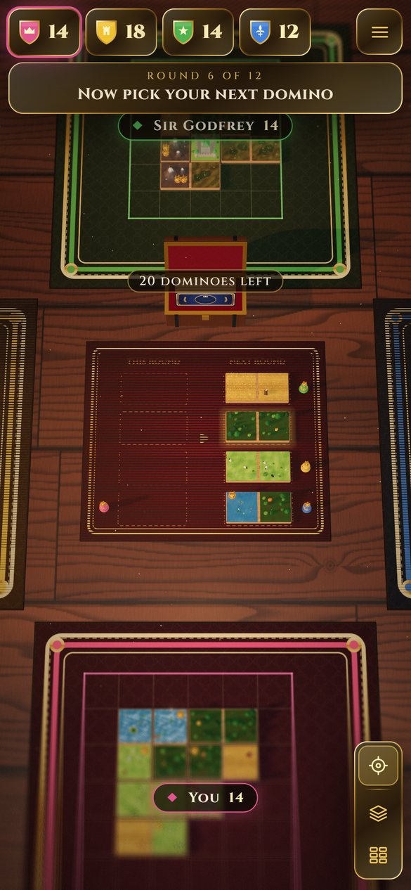
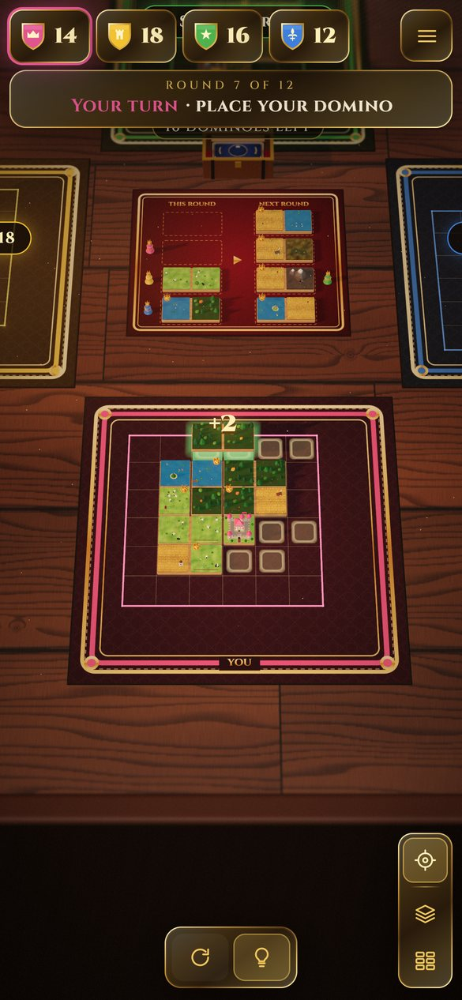

<div align="center">

# Kingdomino 3D

**The Kingdomino board game on a candle-lit 3D table. Play it free in your browser, against the AI or with friends.**

[](https://1amthis.github.io/kingdomino-3d/)

[](https://github.com/1amthis/kingdomino-3d/actions/workflows/deploy.yml)
[](https://threejs.org)
[](https://vite.dev)
[](#playing-with-friends-online)



</div>

Procedural miniature dioramas on every tile, a candle-lit table, animated critters, a generative lute soundtrack and a
full rules engine with AI opponents, all running in the browser with no download and no sign-up.

<table>
  <tr>
    <td width="50%"></td>
    <td width="50%"></td>
  </tr>
  <tr>
    <td><b>Place your domino.</b> The ghost glows green on a legal spot and shows the points it would earn there.</td>
    <td><b>Every tile is a diorama.</b> Windmills turn, sheep graze, sailboats drift and crowns spin over the squares that score.</td>
  </tr>
  <tr>
    <td></td>
    <td></td>
  </tr>
  <tr>
    <td><b>Day, golden hour and night.</b> After dark, windows, lanterns, crystals and fireflies light up.</td>
    <td><b>The reckoning.</b> The camera visits each kingdom and counts every property, squares &times; crowns.</td>
  </tr>
  <tr>
    <td></td>
    <td></td>
  </tr>
  <tr>
    <td><b>2 to 4 players</b>, any mix of humans (same device or online) and AI at three levels. The menu plays a live AI game behind it.</td>
    <td><b>Final scores</b> with every property, the Middle Kingdom and Harmony bonuses, and the official tie-breakers.</td>
  </tr>
</table>

<p align="center">
  
  &nbsp;
  
  &nbsp;
  
  <br />
  <sub>Made for phones too: tap to pick, tap twice to place, pinch to zoom.</sub>
</p>

## What's on the table

- **All 48 official dominoes** with correct terrains and crowns, each carved as a unique diorama.
  - Wheat fields with swaying stalks, windmills with turning sails, cottages with chimney smoke, haystacks, scarecrows
  - Forests of layered pines and round oaks (with the odd autumn tree and mushrooms)
  - Lakes with rippling reflective water, lily pads, islands with watchtowers, drifting sailboats, ducks and leaping fish
  - Grasslands with grazing, wandering sheep, flower patches, fences, wells and butterflies
  - Swamps with murky pools, cattails, dead willows with hanging moss, frogs and fireflies that glow at night
  - Mines with snow-capped peaks, a timbered portal, rails, a cart of gold, a lantern and glowing crystals
  - Gilded 3D crowns hovering and turning over each crowned square
- **Castles** in each house colour with waving flags, lit windows and a drop-in entrance.
- **King meeples** in lacquered wood that hop between the kingdom and the drafting board.
- An **oak chest** that dominoes fly out of face-down (numbered backs), then flip over in sequence.
- A velvet **drafting board**, felt **kingdom mats** embroidered with each player's name, candles with real flickering
  light, a goblet, coins, a scroll, and dust motes drifting through a sunbeam.
- **Day, golden hour and night** (press <kbd>T</kbd>): at night windows, lanterns, crystals and fireflies light up.
- Post-processing: HDR bloom, a subtle **tilt-shift miniature lens**, vignette and film grain.
- **Final scoring**: at the end the camera visits each kingdom, outlines each property in light, counts
  `squares × crowns`, applies bonuses, then fires fireworks and confetti over the winner.
- **All sound is synthesised** at runtime (Web Audio): wooden clacks, whooshes, bells, a brass fanfare and a
  generative D-dorian lute-and-drone score built from Karplus–Strong plucked strings.
- The main menu plays a **live AI-vs-AI game** on the table behind it.

## Rules implemented

- 2–4 players, any mix of humans (hot-seat or online) and AI (Easy / Normal / Hard).
- 2 players: 2 kings each, 24 tiles, opening picks in snake order (A, B, B, A) · 3 players: 36 tiles, lines of 3 · 4 players: all 48 tiles.
- Connection rule (touch the castle or a matching terrain), the 5×5 limit, forced discards when nothing fits.
- Turn order from the drafting line, final scoring with the official tie-breakers.
- Optional **Middle Kingdom** (+10), **Harmony** (+5) and the **Mighty Duel** (2 players, 7×7, all 48 tiles).

## Playing with friends online

Set one or more seats to **Online friend** in the menu and press **Invite your friends**. You get a link like
`https://your-site/?join=k7x2qm`: send it, and each friend who opens it picks a name and takes a free seat. Press
**Start game** once they have joined (online seats that are still empty are played by a Normal AI).

- Your browser is the host: it runs the game and relays every move directly to your friends' browsers
  (WebRTC via [PeerJS](https://peerjs.com); its free public server only introduces the browsers to each other).
  No server of your own is needed.
- If a friend leaves mid-game, an AI finishes their kingdom. If the host leaves, the table closes for everyone.
- Invite links work from the hosted game at <https://1amthis.github.io/kingdomino-3d/>. On `localhost` a link only
  works on your own computer; to host your own copy, see [Put it online](#put-it-online).
- A very strict network (some corporate Wi-Fi) can block the direct connection even with PeerJS's relay.
  Home connections and phone hotspots are almost always fine.

## Controls

| Input | Action |
| --- | --- |
| Click | Pick a domino / place it (tap twice on touch screens) |
| <kbd>R</kbd>, right-click, <kbd>Q</kbd>/<kbd>E</kbd> | Rotate the domino |
| Arrows + <kbd>Enter</kbd> | Move and drop the domino with the keyboard |
| <kbd>G</kbd> | Toggle legal-spot hints |
| Drag / wheel | Orbit / zoom towards the pointer |
| Right-drag, <kbd>Shift</kbd>+drag | Slide the camera across the table |
| <kbd>1</kbd>–<kbd>4</kbd>, or click a player's card | Look at that player's kingdom |
| <kbd>D</kbd> / <kbd>O</kbd> | Look at the drafting board / the whole table |
| <kbd>F</kbd> | Follow play again |
| <kbd>C</kbd> | Seat view ↔ overview |
| <kbd>T</kbd> | Cycle time of day |
| <kbd>M</kbd> | Music on/off |
| <kbd>P</kbd> | Photo mode (hide the interface) |
| <kbd>H</kbd> | Rules & controls |

The camera dock on the right edge does the same with the mouse: follow play, the whole table, the drafting board,
and one crest per player. Following play uses the same shots: the drafting board while dominoes are dealt and
picked, and the kingdom of whoever is placing. Once you move the camera yourself (drag, zoom or a dock view) it stays where you put it while
the others play; it only takes over again when it is your move, or when you press <kbd>F</kbd>.

While placing, the ghost domino glows green or red, shows the points it would earn on that exact spot, and the
glowing frame on your mat shrinks to show the 5×5 space you have left.

## Run it locally

```bash
npm install
npm run dev        # http://localhost:5173
npm run build      # static bundle in dist/
```

## Put it online

The game is a static site: `npm run build` and serve the `dist/` folder from anywhere (it uses relative paths, so a
sub-folder works too).

- **GitHub Pages**: [`.github/workflows/deploy.yml`](.github/workflows/deploy.yml) builds and publishes every push
  to `main`. In a fork, turn it on once in *Settings → Pages → Source: GitHub Actions*, and change the
  `https://1amthis.github.io/kingdomino-3d/` addresses in `index.html` and `public/sitemap.xml` to your own.
- **Anywhere else**: drag `dist/` onto [Netlify Drop](https://app.netlify.com/drop), or use Cloudflare Pages.

## Code map

```
src/
  core/rules.js      tiles, Kingdom (placement rules, properties, scoring), ranking
  core/ai.js         heuristic AI: evaluates kingdoms (crowns, open frontiers, dead cells, bonuses)
  core/rng.js        seeded PRNG so every tile's diorama is stable
  gfx/stage.js       renderer, lights, ambience presets, post-processing, camera flights
  gfx/terrain.js     procedural diorama recipes for the six terrains
  gfx/geo.js         vertex-coloured geometry batching (one draw call per material per tile)
  gfx/domino.js      DominoView: base, dioramas, crowns, numbered back, highlight glow
  gfx/pieces.js      crowns, castles, kings, candles, trinkets
  gfx/table.js       table, mats, drafting board, chest
  gfx/effects.js     dust, sparkles, fireworks, confetti
  gfx/materials.js   shared materials, wind sway and night-glow shader hooks
  gfx/textures.js    canvas-painted wood, felt, tile backs, water normals
  audio/sound.js     synthesised SFX and generative music
  ui/hud.js          menu, lobby, player cards, prompts, tooltips, results
  net/online.js      online tables: host/guest sessions over PeerJS, move relay, shared deal seed
  game/controller.js game flow, animation choreography, camera direction, input
```

In the browser console, `kingdomino` exposes the stage, controller and HUD for tinkering
(e.g. `kingdomino.stage.setAmbience('night')`).

## Credits

Kingdomino is a board game designed by Bruno Cathala and published by Blue Orange Games. This is an unofficial,
non-commercial fan adaptation, not affiliated with or endorsed by them. If you enjoy it, buy the real box!
