<div align="center">

# Kingdomino 3D

**The Kingdomino board game on a candle-lit 3D table. Play it free in your browser: against an Expert AI that plays
out thousands of games before each move, with a coach that grades yours, or with friends online.**

[](https://1amthis.github.io/kingdomino-3d/)

[](https://github.com/1amthis/kingdomino-3d/actions/workflows/deploy.yml)
[](#the-ai)
[](#the-coach)
[](#playing-with-friends-online)
[](https://threejs.org)
[](https://vite.dev)

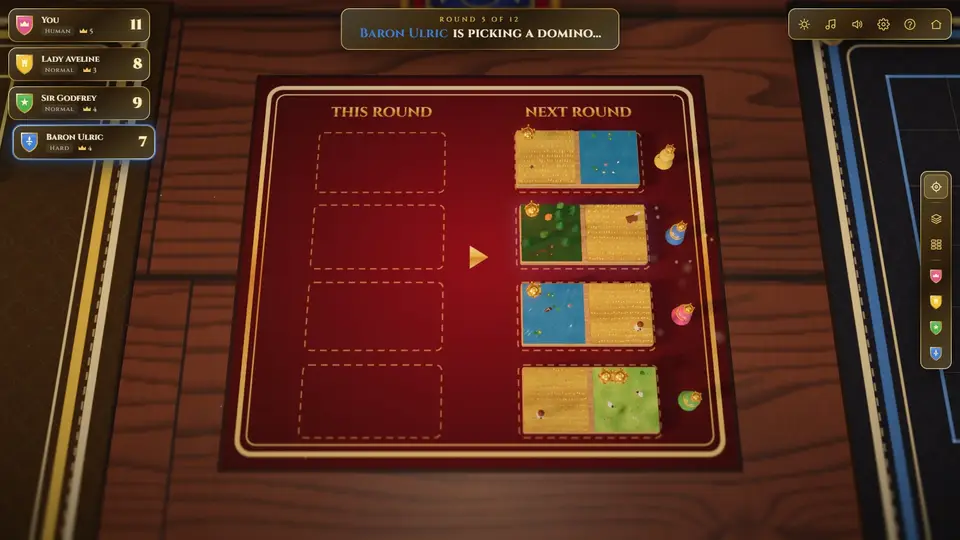

</div>

Procedural miniature dioramas on every tile, a candle-lit table, animated critters, a generative lute soundtrack, a
full rules engine and four levels of AI, all running in the browser with no download and no sign-up.

## Take on the Expert, learn from the coach

<table>
  <tr>
    <td width="50%">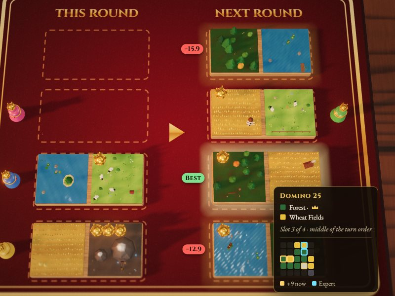</td>
    <td width="50%">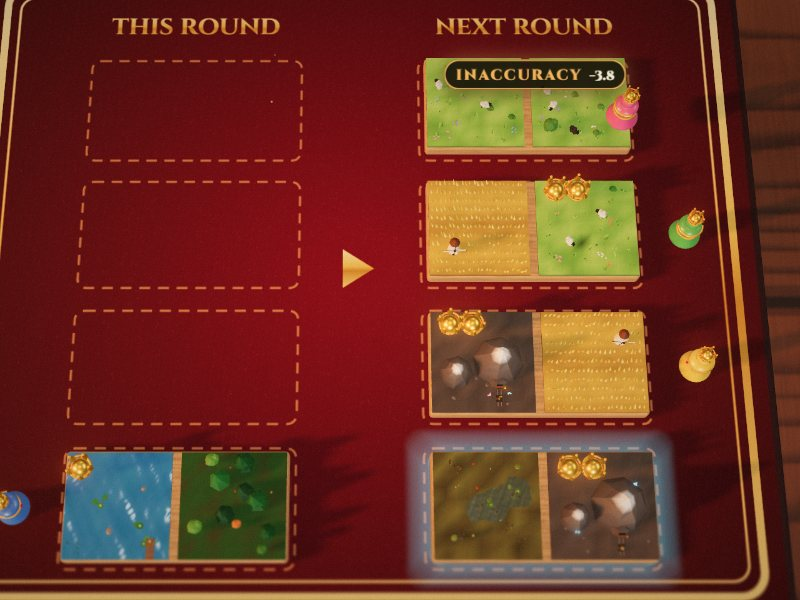</td>
  </tr>
  <tr>
    <td><b>Study mode.</b> Every draft domino carries what it gives up against the Expert's pick. Hover one to see where it scores most right now (gold) and where the Expert would lay it (blue).</td>
    <td><b>Every move graded</b>, from Best to Blunder, by the points of final lead it gives up. After a poor move, the Expert's choice flashes blue.</td>
  </tr>
  <tr>
    <td>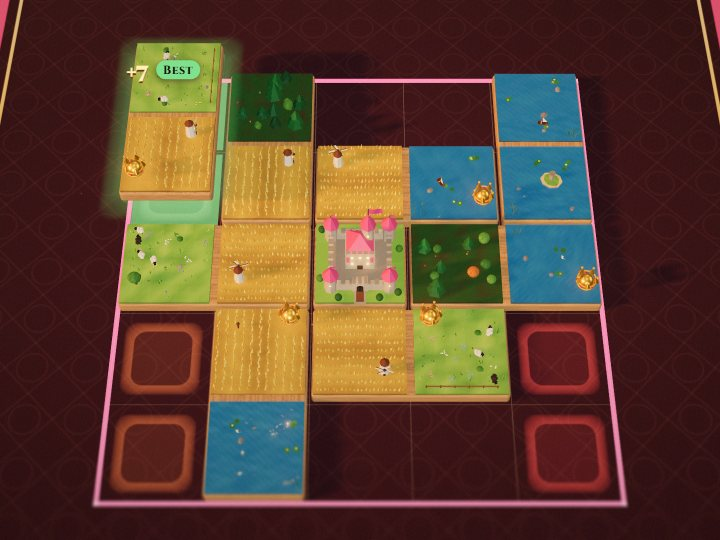</td>
    <td>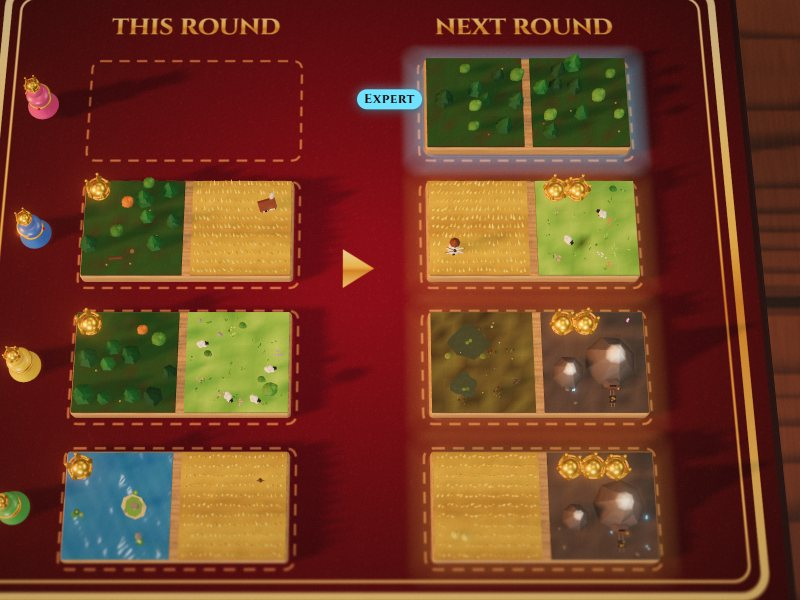</td>
  </tr>
  <tr>
    <td><b>Where to lay it.</b> The legal squares are tinted from green to red, and the ghost domino shows what its spot is worth.</td>
    <td><b>Stuck? Ask.</b> Advice (<kbd>A</kbd>) shows the Expert's move: its pick glows blue, or the ghost domino slides to its spot.</td>
  </tr>
</table>

- **Expert** plans ahead with a Monte-Carlo tree search in a Web Worker: before each move it plays out thousands of
  games, each with the unseen dominoes dealt afresh, and keeps the move that held up best. Against the Hard AI it wins
  83 two-player games in 100, and all 40 Mighty Duels ([how it works](#the-ai)).
- **The coach** is the same search pointed at your position. **Trainer** grades each of your moves; **Study** also
  shows what every option is worth while you decide. At the end, the results card gives its verdict: points lost per
  move and how your grades split ([more](#the-coach)).
- Set a seat to **Expert** and the coach to **Trainer** or **Study** in the menu. For fair play, the coach turns itself
  off whenever more than one person plays.

## What's on the table

<table>
  <tr>
    <td width="50%">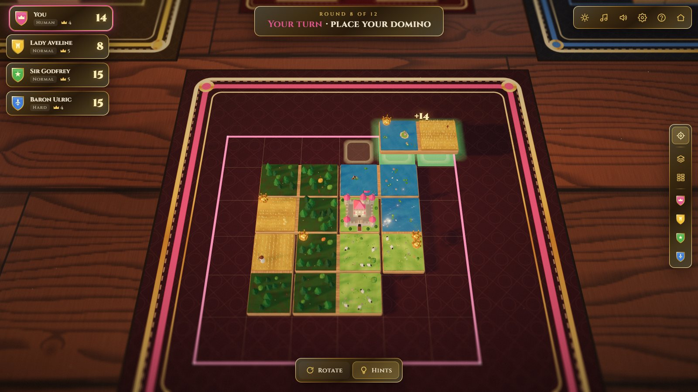</td>
    <td width="50%">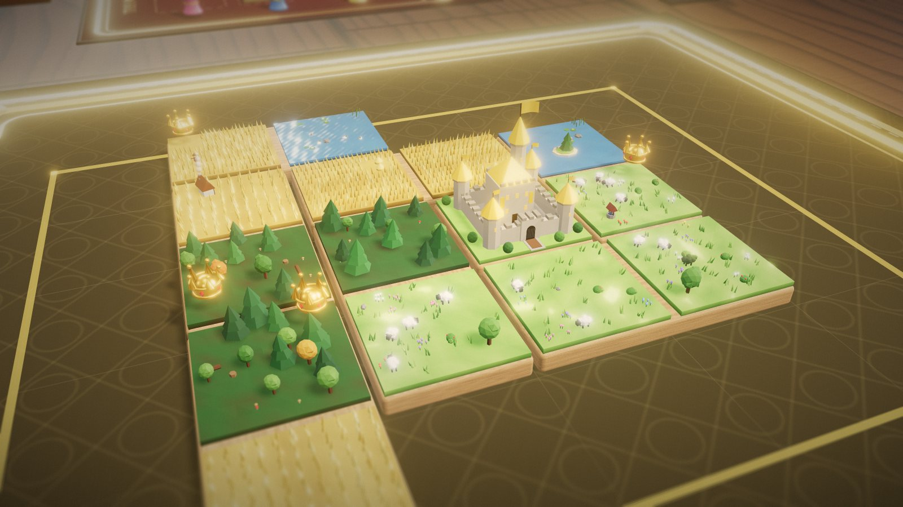</td>
  </tr>
  <tr>
    <td><b>Place your domino.</b> The ghost glows green on a legal spot and shows the points it would earn there.</td>
    <td><b>Every tile is a diorama.</b> Windmills turn, sheep graze, sailboats drift and crowns spin over the squares that score.</td>
  </tr>
  <tr>
    <td>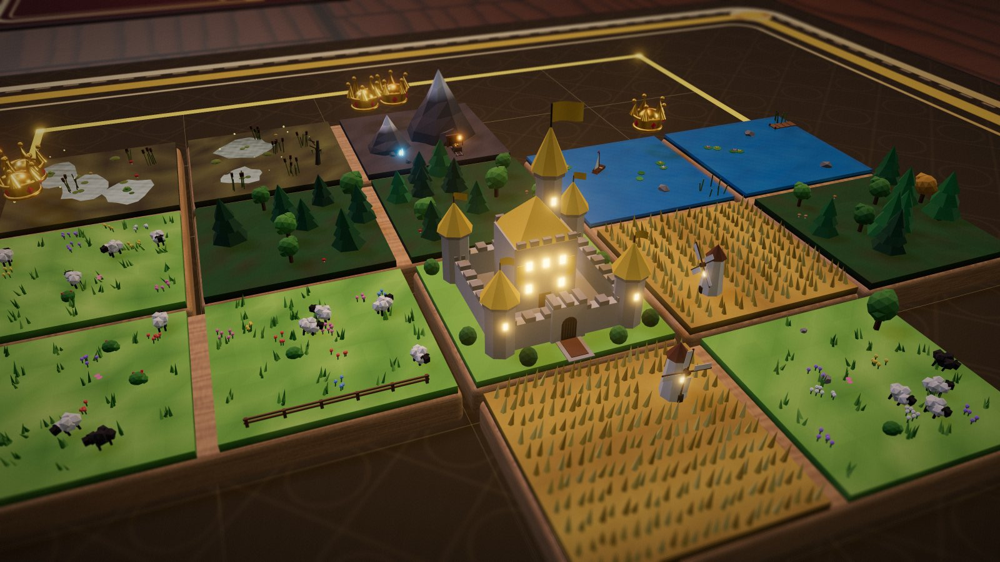</td>
    <td>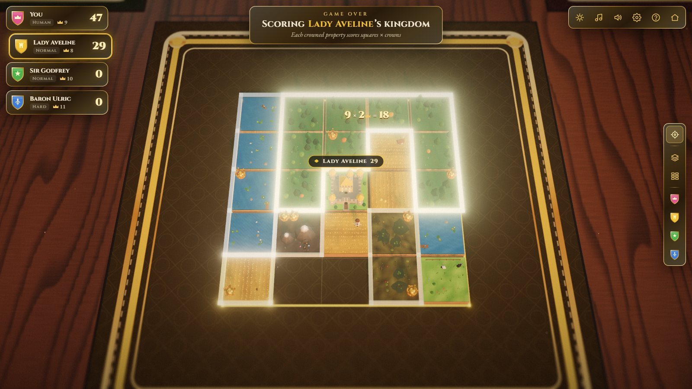</td>
  </tr>
  <tr>
    <td><b>Day, golden hour and night.</b> After dark, windows, lanterns, crystals and fireflies light up.</td>
    <td><b>The reckoning.</b> The camera visits each kingdom and counts every property, squares &times; crowns.</td>
  </tr>
  <tr>
    <td>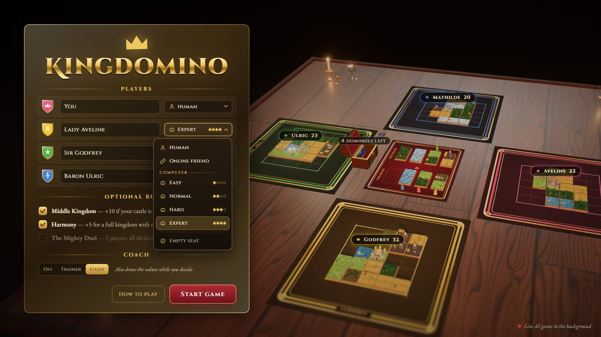</td>
    <td>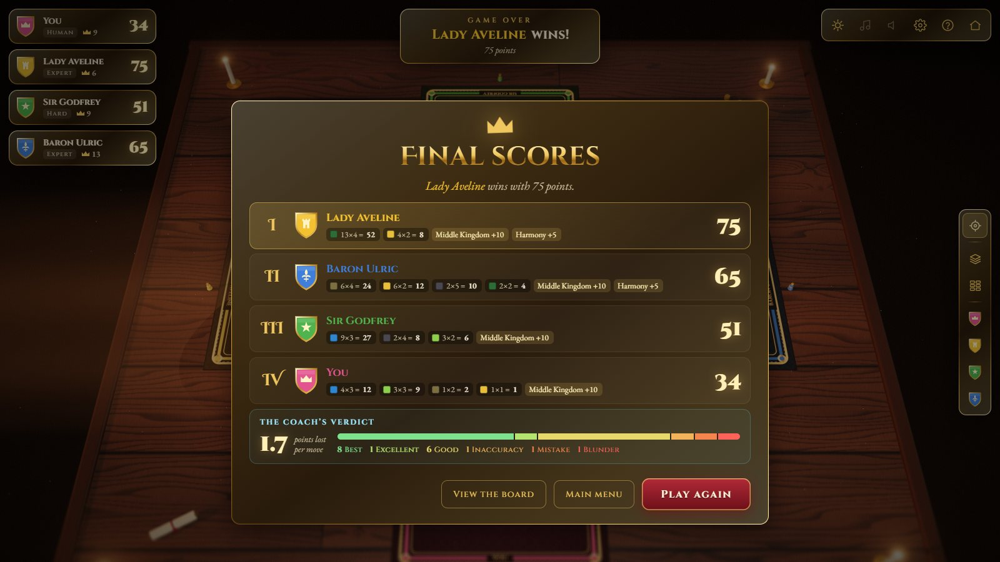</td>
  </tr>
  <tr>
    <td><b>2 to 4 players</b>, any mix of humans (same device or online) and AI at four levels, from Easy to Expert. The menu plays a live AI game behind it.</td>
    <td><b>Final scores</b> with every property, the Middle Kingdom and Harmony bonuses and the official tie-breakers, plus the coach's verdict.</td>
  </tr>
</table>

<p align="center">
  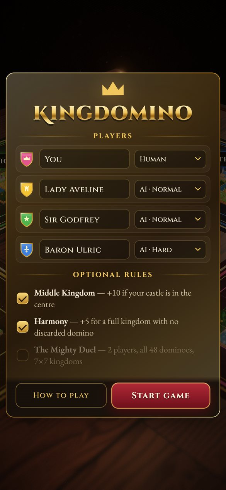
  &nbsp;
  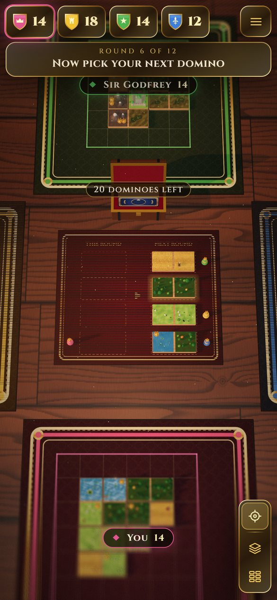
  &nbsp;
  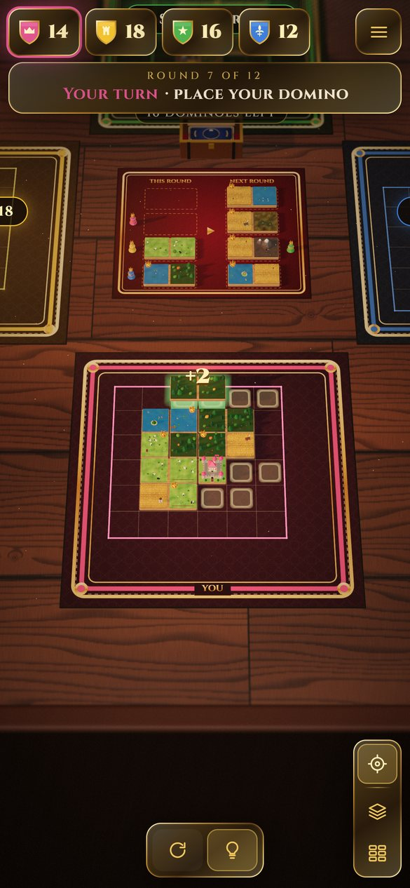
  <br />
  <sub>Made for phones too: tap to pick, tap twice to place, pinch to zoom.</sub>
</p>

- **All 48 official dominoes** with correct terrains and crowns, each carved as a unique diorama.
  - Wheat fields with swaying stalks, windmills with turning sails, cottages with chimney smoke, haystacks, scarecrows
  - Forests of layered pines and round oaks (with the odd autumn tree and mushrooms)
  - Lakes with rippling reflective water, lily pads, islands with watchtowers, drifting sailboats, ducks and leaping fish
  - Grasslands with grazing, wandering sheep, flower patches, fences, wells and butterflies
  - Swamps with murky pools, cattails, dead willows with hanging moss, frogs and fireflies that glow at night
  - Mines with snow-capped peaks, a timbered portal, rails, a cart of gold, a lantern and glowing crystals
  - Gilded 3D crowns hovering and turning over each crowned square
- **Castles** in each house colour with waving flags, lit windows and a drop-in entrance.
- **King meeples** in lacquered wood that hop between the kingdom and the drafting board.
- An **oak chest** that dominoes fly out of face-down (numbered backs), then flip over in sequence.
- A velvet **drafting board**, felt **kingdom mats** embroidered with each player's name, candles with real flickering
  light, a goblet, coins, a scroll, and dust motes drifting through a sunbeam.
- **Day, golden hour and night** (press <kbd>T</kbd>): at night windows, lanterns, crystals and fireflies light up.
- Post-processing: HDR bloom, a subtle **tilt-shift miniature lens**, vignette and film grain.
- **Final scoring**: at the end the camera visits each kingdom, outlines each property in light, counts
  `squares × crowns`, applies bonuses, then fires fireworks and confetti over the winner.
- **All sound is synthesised** at runtime (Web Audio): wooden clacks, whooshes, bells, a brass fanfare and a
  generative D-dorian lute-and-drone score built from Karplus–Strong plucked strings.
- The main menu plays a **live AI-vs-AI game** on the table behind it.

## Rules implemented

- 2–4 players, any mix of humans (hot-seat or online) and AI (Easy / Normal / Hard / Expert, see [The AI](#the-ai)).
- 2 players: 2 kings each, 24 tiles, opening picks in snake order (A, B, B, A) · 3 players: 36 tiles, lines of 3 · 4 players: all 48 tiles.
- Connection rule (touch the castle or a matching terrain), the 5×5 limit, forced discards when nothing fits.
- Turn order from the drafting line, final scoring with the official tie-breakers.
- Optional **Middle Kingdom** (+10), **Harmony** (+5) and the **Mighty Duel** (2 players, 7×7, all 48 tiles).

## The AI

- **Easy, Normal and Hard** look one move ahead and weigh the kingdom by hand-tuned rules: crowned properties and
  their open edges, squares that can no longer be filled, the chance of a bonus. Hard also takes dominoes a rival wants.
- **Expert** searches. It runs a determinized Monte-Carlo tree search in a Web Worker, so the table keeps animating
  while it thinks: every simulation deals the unseen dominoes afresh, then plays the game out to the end. A few thousand
  simulations per move take a fraction of a second.

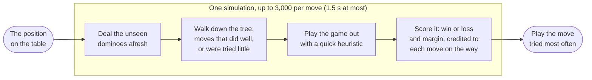
```mermaid
flowchart LR
    pos(["The position<br/>on the table"]) --> deal
    subgraph sim ["One simulation, up to 3,000 per move (1.5 s at most)"]
        direction LR
        deal["Deal the unseen<br/>dominoes afresh"] --> walk["Walk down the tree:<br/>moves that did well,<br/>or were tried little"]
        walk --> out["Play the game out<br/>with a quick heuristic"]
        out --> back["Score it: win or loss<br/>and margin, credited to<br/>each move on the way"]
    end
    back --> move(["Play the move<br/>tried most often"])
```

Expert against Hard, on paired deals (each deal played from both seats), 2,000 simulations per move:

| Game | Expert's record | Average lead |
| --- | --- | --- |
| 2 players | 83 wins, 17 losses | +10.2 points |
| 2 players, Middle Kingdom + Harmony | 81 wins, 19 losses | +12.4 points |
| Mighty Duel (7×7) | 40 wins, 0 losses | +27.6 points |
| 4 players (Expert and 3 Hard) | 24 wins in 40 games | +1.2 points over the best Hard |

`npm run bench` replays these (`--games`, `--players`, `--vs easy|normal|hard`, `--sims`, `--middle`, `--harmony`,
`--duel`), and `npm test` checks the search engine against the rules engine, placement for placement and score for score.

`npm run study` points the same search at the game itself: what each domino is worth as a first pick and what a later
slot costs (`openings`), who wins from which seat and what winning kingdoms are made of (`selfplay`), and how to lay a
domino (`firstplace`, `placement`). Runs save as they go and pick up where they stopped; the options are at the top of
[`scripts/study.js`](scripts/study.js).

### The coach

Pick it in the main menu (or in Settings during a game). While you decide, the Expert quietly analyses your position
in a worker of its own: the same search, up to 8,000 simulations, with at least 24 for every legal move. For fair play the coach locks itself off whenever more than one
person is at the table, on the same screen or online.

- **Trainer**: once you move, a badge pops up on it, from **Best** through Excellent, Good, Inaccuracy and Mistake to
  **Blunder**, by the points of expected final lead the move gives up against the Expert's choice (0.3, 1, 2.5, 5 and 9
  points). After a poor move, the Expert's choice flashes blue on the table. **Advice** (<kbd>A</kbd>) shows the
  Expert's move: its pick glows blue, or the ghost domino moves to its spot; a light on the button shows when the coach
  is ready. The results card sums up your game: points lost per move and how your grades split.
- **Study**: all of that, and the values show while you decide. Every draft domino carries a pill with what it gives
  up against the best pick; the legal squares on your mat are tinted from green to red; the ghost domino shows what its
  spot gives up. Hovering a draft domino maps where it would score most right now and where the Expert would lay it.

## Playing with friends online

Set one or more seats to **Online friend** in the menu and press **Invite your friends**. You get a link like
`https://your-site/?join=k7x2qm`: send it, and each friend who opens it picks a name and takes a free seat. Press
**Start game** once they have joined (online seats that are still empty are played by a Normal AI).

- Your browser is the host: it runs the game and relays every move directly to your friends' browsers
  (WebRTC via [PeerJS](https://peerjs.com); its free public server only introduces the browsers to each other).
  No server of your own is needed.
- If a friend leaves mid-game, an AI finishes their kingdom. If the host leaves, the table closes for everyone.
- Invite links work from the hosted game at <https://1amthis.github.io/kingdomino-3d/>. On `localhost` a link only
  works on your own computer; to host your own copy, see [Put it online](#put-it-online).
- A very strict network (some corporate Wi-Fi) can block the direct connection even with PeerJS's relay.
  Home connections and phone hotspots are almost always fine.

## Controls

| Input | Action |
| --- | --- |
| Click | Pick a domino / place it (tap twice on touch screens) |
| <kbd>R</kbd>, right-click, <kbd>Q</kbd>/<kbd>E</kbd> | Rotate the domino |
| Arrows + <kbd>Enter</kbd> | Move and drop the domino with the keyboard |
| <kbd>G</kbd> | Toggle legal-spot hints |
| <kbd>A</kbd> | Advice: the Expert's move (with the coach on) |
| Drag / wheel | Orbit / zoom towards the pointer |
| Right-drag, <kbd>Shift</kbd>+drag | Slide the camera across the table |
| <kbd>1</kbd>–<kbd>4</kbd>, or click a player's card | Look at that player's kingdom |
| <kbd>D</kbd> / <kbd>O</kbd> | Look at the drafting board / the whole table |
| <kbd>F</kbd> | Follow play again |
| <kbd>C</kbd> | Seat view ↔ overview |
| <kbd>T</kbd> | Cycle time of day |
| <kbd>M</kbd> | Music on/off |
| <kbd>P</kbd> | Photo mode (hide the interface) |
| <kbd>H</kbd> | Rules & controls |

The camera dock on the right edge does the same with the mouse: follow play, the whole table, the drafting board,
and one crest per player. Following play uses the same shots: the drafting board while dominoes are dealt and
picked, and the kingdom of whoever is placing. Once you move the camera yourself (drag, zoom or a dock view) it stays where you put it while
the others play; it only takes over again when it is your move, or when you press <kbd>F</kbd>.

While placing, the ghost domino glows green or red, shows the points it would earn on that exact spot, and the
glowing frame on your mat shrinks to show the 5×5 space you have left.

## Run it locally

```bash
npm install
npm run dev        # http://localhost:5173
npm run build      # static bundle in dist/
npm test           # rules and AI checks (Node 20+)
```

## Put it online

The game is a static site: `npm run build` and serve the `dist/` folder from anywhere (it uses relative paths, so a
sub-folder works too).

- **GitHub Pages**: [`.github/workflows/deploy.yml`](.github/workflows/deploy.yml) builds and publishes every push
  to `main`. In a fork, turn it on once in *Settings → Pages → Source: GitHub Actions*, and change the
  `https://1amthis.github.io/kingdomino-3d/` addresses in `index.html` to your own (the build writes `sitemap.xml`
  from its canonical link).
- **Anywhere else**: drag `dist/` onto [Netlify Drop](https://app.netlify.com/drop), or use Cloudflare Pages.

## Code map

```
src/
  core/rules.js      tiles, Kingdom (placement rules, properties, scoring), ranking
  core/ai.js         heuristic AI: evaluates kingdoms (crowns, open frontiers, dead cells, bonuses)
  core/coach.js      the coach's grades: points given up against the Expert's move, a game's tally
  core/rng.js        seeded PRNG so every tile's diorama is stable
  core/search/       the Expert AI: engine.js (typed-array kingdoms for fast playouts), mcts.js (the tree search),
                     state.js (table ⇄ search state), worker.js + expert.js (the Web Workers, one for the Expert's
                     moves and one for the coach's analyses, and their main-thread client)
  gfx/stage.js       renderer, lights, ambience presets, post-processing, camera flights
  gfx/terrain.js     procedural diorama recipes for the six terrains
  gfx/geo.js         vertex-coloured geometry batching (one draw call per material per tile)
  gfx/domino.js      DominoView: base, dioramas, crowns, numbered back, highlight glow
  gfx/pieces.js      crowns, castles, kings, candles, trinkets
  gfx/table.js       table, mats, drafting board, chest
  gfx/effects.js     dust, sparkles, fireworks, confetti
  gfx/materials.js   shared materials, wind sway and night-glow shader hooks
  gfx/textures.js    canvas-painted wood, felt, tile backs, water normals
  audio/sound.js     synthesised SFX and generative music
  ui/hud.js          menu, lobby, player cards, prompts, tooltips, results
  net/online.js      online tables: host/guest sessions over PeerJS, move relay, shared deal seed
  game/controller.js game flow, animation choreography, camera direction, input
  game/coach.js      the coach at the table: analyses, grades, advice, study notes, the results verdict
scripts/
  headless.js        the game flow without the 3D, for benchmarks and tests
  bench.js           Expert against a heuristic level on paired deals
  study.js           strategy studies with the Expert's search: opening picks, seats, how to lay dominoes
tests/
  search.test.js     search engine vs rules engine; the Expert's moves stay legal in every setup
  coach.test.js      the analysis covers every move soundly; grades follow from it
```

In the browser console, `kingdomino` exposes the stage, controller and HUD for tinkering
(e.g. `kingdomino.stage.setAmbience('night')`).

## Credits and license

Kingdomino is a board game designed by Bruno Cathala and published by Blue Orange Games. This is an unofficial,
non-commercial fan adaptation, not affiliated with or endorsed by them. If you enjoy it, buy the real box!

The code is released under the [MIT license](LICENSE). The license covers this code only, not the Kingdomino name or
game design.
